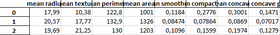

# Classificador de Câncer de mama

### Atividade desenvolvida para o trabalho final da disciplina de Inteligência Computacional

## Equipe

<table style="text-align: center">
  <tr>
    <td> <b>Adrian Grosch</b></td>
    <td> <b>Matheus Parro de Sousa</b></td>
  </tr>
</table>

## Problema

O problema se trata de uma classificação de nódulos mamários, sendo eles malignos ou benignos, baseado em um dataset que contém suas características
 

## Dataset

O dataset utilizado para o presente classificador é uma cópia dos conjuntos de dados UCI ML Breast Cancer Wisconsin (Diagnostic) disponível em: <a href="https://goo.gl/U2Uwz2">https://goo.gl/U2Uwz2</a>.

As características são computadas através da imagem digitalizada da massa do nódulo adquirida através de uma agulha
extremamente fina e representam as características dos núcleos celulares presentes na imagem.

Estas características foram levantadas juntamente com médicos da área que até então consideraram as mesmas como relevantes durante a análise de um câncer de mama
<table>
<tr>
<th colspan="100%">Características do conjunto de dados</th></tr>
<tr><td>Número de Instâncias</td><td>569</td></tr>
<tr><td>Distribuição das classes</td><td>212 - Maligno | 357 - Benigno</td></tr>
<tr><td>Número de Atributos</td><td>30 atributos numéricos preditivos e a classe
</td></tr>
<tr><td>Informação de Atributo</td><td>
<ul>
<li>Raio (média das distâncias do centro aos pontos do perímetro)</li>
<li>Textura (desvio padrão dos valores da escala de cinza)</li>
<li>Perímetro</li>
<li>Área</li>
<li>Suavidade (variação local em comprimentos de raio)</li>
<li>Compacidade (perímetro ^ 2 / área - 1,0)</li>
<li>Concavidade (gravidade das porções côncavas do contorno)</li>
<li>Pontos côncavos (número de porções côncavas do contorno)</li>
<li>Simetria</li>
<li>Dimensão fractal (“aproximação do litoral” - 1)</li>
<li>Classe (Maligno | Benigno)</li>
</ul>
</td></tr>
<tr>
<td colspan="100%">
Cada característica avaliada foi separada em 3 conjuntos. Média, desvio padrão e pior. Por exemplo, se pegarmos o "Raio" são avaliados os núcleos presentes na imagem capturada para um determinado nódulo, sendo separada uma média dos raios, o desvio padrão do raio e o pior raio.  
</td>
</tr>
<tr>
</tr>
</table>

## Técnica

Para desenvolver o trabalho, foi utilizada a biblioteca Scikit Learn, que é uma biblioteca de machine learning presente na linguagem Python. A biblioteca foi utilizada pois já fornece nativamente uma grande quantia de datasets prontos para uso e também um módulo que nos permite aplicar a téncica da Árvore de Decisão, um dos métodos mais comuns dentro da aprendizagem de máquina, para realizar a classificação desejada.

As entradas da árvore de decisão são os valores correspondentes às características retiradas dos núcleos celulares das massas dos nódulos das amostras, como por exemplo (Raio, perímetro, textura,etc),  

 
Com os valores destas características(entradas) a árvore realiza o processo de treinamento.
Para o treinamento, foram utilizados os seguintes parâmetros: Profundidade da árvore, tamanho dos dados teste e o critério para realizar a divisão ótima das carecterísticas, após esse treino, a arvore consegue indentificar as importâncias de cada caracteristica do cancer, e com isso consegue definir a melhor maneira de analisar cada amostra do dataset. O resultado possível (saída) para cada amostra é apenas um, a situação do câncer definida de forma binária [ 0  | Benigno] ou [ 1 | maligno].
  
 **Técnica de Avaliação do Modelo** 
  Foi utilizada a técnica de validação cruzada k-fold, para avaliar a precisão do modelo na pratica, ou seja seu desempenho para um novo conjunto de dados 
  
  
 **Métricas de Avaliação 
  Para realizar a avaliação do modelo, utilizamos uma matriz de confusão,
   
  

   
  Juntamente com a acurácia, precisão, recall e f1-score
  

 
## Resultados Obtidos
    
   O experimento foi realizado utilizando diferente combinações de parametros, afim de obter o melhor resultado (sáida) possivel 
   
  Foram realizados 200 testes (arquivo check_parameters.py) alteranando o critério entre "Entropy" e "GINI", profundidade entre 1 e 100, tamanho do teste entre 0.1 e 0.9
   
  Com isso conseguimos os seguintes valores, pois os mesmos resultam no melhor f1-score, que é a média harmonica entre a precisão e o recall
   
  **Precisão**
    
    Dentre todas as classificações de classe Positivo que o modelo fez, quantas estão corretas;
   
  **Recall(Sensibilidade)**
    
   Dentre todas as situações de classe Positivo como valor esperado, quantas estão corretas;
   

  **Valores**
    
  <li>Profundidade da árvore: 77.4</li>  
  <li>Tamanho dos dados de teste: 0.14</li>  
  <li>Crtitério de divisão: Entropia</li>  
  
   
  
  
## Instruções de uso do software
## Vídeo

