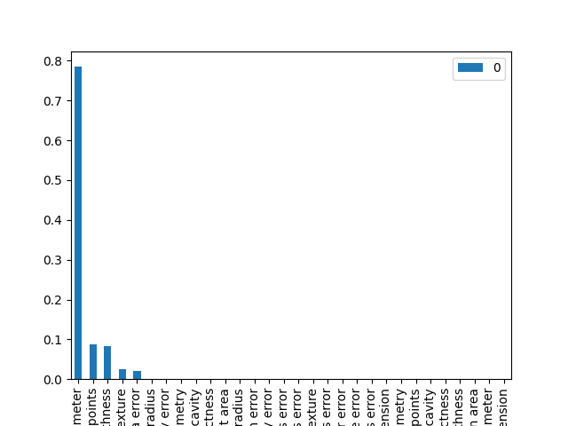
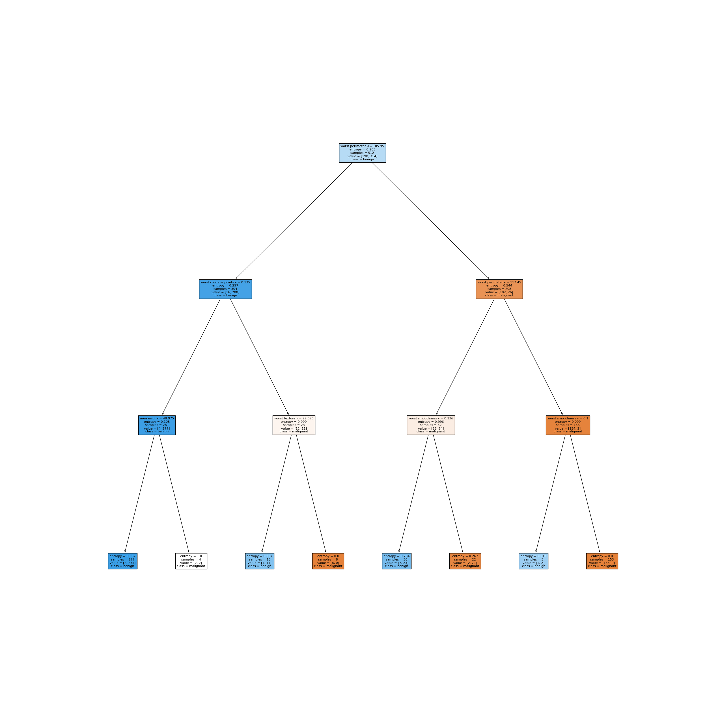

# Classificador de Câncer de mama

### Atividade desenvolvida para o trabalho final da disciplina de Inteligência Computacional

## Equipe

<table style="text-align: center">
  <tr>
    <td> <b>Adrian Grosch</b></td>
    <td> <b>Matheus Parro de Sousa</b></td>
  </tr>
</table>

## Problema

O problema se trata de uma classificação de nódulos mamários, sendo eles malignos ou benignos, baseado em um dataset que contém suas características
 

## Dataset

O dataset utilizado para o presente classificador é uma cópia dos conjuntos de dados UCI ML Breast Cancer Wisconsin (Diagnostic) disponível em: <a href="https://goo.gl/U2Uwz2">https://goo.gl/U2Uwz2</a>.

As características são computadas através da imagem digitalizada da massa do nódulo adquirida através de uma agulha
extremamente fina e representam as características dos núcleos celulares presentes na imagem.

Estas características foram levantadas juntamente com médicos da área que até então consideraram as mesmas como
relevantes durante a análise de um câncer de mama
<table>
<tr>
<th colspan="100%">Características do conjunto de dados</th></tr>
<tr><td>Número de Instâncias</td><td>569</td></tr>
<tr><td>Distribuição das classes</td><td>212 - Maligno | 357 - Benigno</td></tr>
<tr><td>Número de Atributos</td><td>30 atributos numéricos preditivos e a classe
</td></tr>
<tr><td>Informação de Atributo</td><td>
<ul>
<li>Raio (média das distâncias do centro aos pontos do perímetro)</li>
<li>Textura (desvio padrão dos valores da escala de cinza)</li>
<li>Perímetro</li>
<li>Área</li>
<li>Suavidade (variação local em comprimentos de raio)</li>
<li>Compacidade (perímetro ^ 2 / área - 1,0)</li>
<li>Concavidade (gravidade das porções côncavas do contorno)</li>
<li>Pontos côncavos (número de porções côncavas do contorno)</li>
<li>Simetria</li>
<li>Dimensão fractal (“aproximação do litoral” - 1)</li>
<li>Classe (Maligno | Benigno)</li>
</ul>
</td></tr>
<tr>
<td colspan="100%">
Cada característica avaliada foi separada em 3 conjuntos. Média, desvio padrão e pior. Por exemplo, se pegarmos o "Raio" são avaliados os núcleos presentes na imagem capturada para um determinado nódulo, sendo separada uma média dos raios, o desvio padrão do raio e o pior raio.  
</td>
</tr>
<tr>
</tr>
</table>

## Técnica

Para desenvolver o trabalho, foi utilizada a biblioteca Scikit Learn, que é uma biblioteca de machine learning presente na linguagem Python. A biblioteca foi utilizada pois já fornece nativamente uma grande quantia de datasets prontos para uso e também um módulo que nos permite aplicar a técnica da Árvore de Decisão, um dos métodos mais comuns dentro da aprendizagem de máquina, para realizar a classificação desejada.

As entradas da árvore de decisão são os valores correspondentes às características retiradas dos núcleos celulares das
massas dos nódulos das amostras, como por exemplo (Raio, perímetro, textura,etc),  

 
Com os valores destas características(entradas) a árvore realiza o processo de treinamento.
Para o treinamento, foram utilizados os seguintes parâmetros: Profundidade da árvore, tamanho dos dados teste e o critério para realizar a divisão ótima das carecterísticas, após esse treino, a arvore consegue indentificar as importâncias de cada caracteristica do cancer, e com isso consegue definir a melhor maneira de analisar cada amostra do dataset. O resultado possível (saída) para cada amostra é apenas um, a situação do câncer definida de forma binária [ 0  | Benigno] ou [ 1 | maligno].

**Técnica de Avaliação do Modelo** 
Foi utilizada a técnica de validação cruzada k-fold, para avaliar a precisão do modelo na pratica, ou seja seu
desempenho para um novo conjunto de dados 

## Métricas de Avaliação

Para realizar a avaliação do modelo, utilizamos uma matriz de confusão,
 

   
  Juntamente com a acurácia, precisão, recall e f1-score
  

## Resultados obtidos

O experimento foi realizado utilizando diferente combinações de parametros, afim de obter o melhor resultado (sáida) possivel
 

  Foram realizados 200 testes (arquivo check_parameters.py) alteranando o critério entre "Entropy" e "GINI", profundidade entre 1 e 100, tamanho do teste entre 0.1 e 0.9

  Com isso conseguimos os seguintes valores, pois os mesmos resultam no melhor f1-score, que é a média harmonica entre a precisão e o recall

#### Recall(Sensibilidade)

Dentre todas as classificações de classe Positivo que o modelo fez, quantas estão corretas;

#### Recall(Sensibilidade)

Dentre todas as situações de classe Positivo como valor esperado, quantas estão corretas;

#### Gini

A impureza de gini é calculada através da fórmula:

Onde Pj é a probabilidade da classe j.

A impureza Gini mede a frequência com que qualquer elemento do conjunto de dados será rotulado incorretamente quando for
rotulado aleatoriamente. O valor mínimo do Índice de Gini é 0. Isso acontece quando o nó é puro , isso significa que
todos os elementos contidos no nó são de uma única classe.

#### Entropia

A entropia é calculada usando a seguinte fórmula:

Onde, como antes,Pj é a probabilidade da classe j. A entropia é uma medida de informação que indica a desordem das
feições com o alvo. Semelhante ao Índice de Gini, a divisão ótima é escolhida pelo recurso com menor entropia

### Gini vs Entropia

O Índice de Gini tem valores dentro do intervalo [0, 0,5] enquanto que o intervalo da Entropia é [0, 1]. Na figura a
seguir, ambos estão representados

Computacionalmente, a entropia é mais complexa, pois faz uso de logaritmos e, consequentemente, o cálculo do Índice de
Gini será mais rápido.

### Parâmetros

  <li>Profundidade da árvore: 3</li> 
  <li>Tamanho dos dados de teste: 0.1</li> 
  <li>Critério de divisão: Entropia</li> 

Chegamos nesses valores de parametros atráves de diversos testes realizados na classe calc_parameters.py. Para
demonstrar alguns destes testes realizados, selecionamos 4 exemplos:
<table>
<tr>
<td colspan="100%" style="text-align: center">Melhores parâmetros</td>
</tr>
<tr>
<td>Profundidade da Árvore</td>
<td>Tamanho dos dados de Teste</td>
<td>Critério de divisão</td>
<td>Acurácia</td>
<td>Precisão</td>
<td>Recall</td>
<td>F1-Score</td>
</tr>
<tr>
<td>3</td>
<td>0.1</td>
<td>Entropia</td>
<td>0.98</td>
<td>0.98</td>
<td>1</td>
<td>0.99</td>
</tr>
</table>
<table>
<td colspan="100%" style="text-align: center">Melhores parâmetros, porém com o critério de divisão alterado para Gini, a fim de descobrir o melhor critério para nosso modelo</td>

<tr>
<td>Profundidade da Árvore</td>
<td>Tamanho dos dados de Teste</td>
<td>Critério de divisão</td>
<td>Acurácia</td>
<td>Precisão</td>
<td>Recall</td>
<td>F1-Score</td>
</tr>
<tr>
<td>3</td>
<td>0.1</td>
<td>Gini</td>
<td>0.93</td>
<td>0.95</td>
<td>0.95</td>
<td>0.95</td>

</tr>
</table>
<table>
<td colspan="100%" style="text-align: center">Teste com valores aleatórios</td>
<tr>
<td>Profundidade da Árvore</td>
<td>Tamanho dos dados de Teste</td>
<td>Critério de divisão</td>
<td>Acurácia</td>
<td>Precisão</td>
<td>Recall</td>
<td>F1-Score</td>
</tr>
<tr>
<td>3</td>
<td>0.5</td>
<td>Entropia</td>
<td>0.90</td>
<td>0.98</td>
<td>0.86</td>
<td>0.92</td>

</tr>
</table>
<table>
<td colspan="100%" style="text-align: center">Teste com valores aleatórios</td>
<tr>
<td>Profundidade da Árvore</td>
<td>Tamanho dos dados de Teste</td>
<td>Critério de divisão</td>
<td>Acurácia</td>
<td>Precisão</td>
<td>Recall</td>
<td>F1-Score</td>
</tr>
<tr>
<td>100</td>
<td>0.9</td>
<td>Entropia</td>
<td>0.86</td>
<td>0.99</td>
<td>0.80</td>
<td>0.88</td>
</tr>
</table>

    Selecionamos os melhores parametros através de uma análise feita a partir do conjunto dos valores resultades de

Acurácia, Precisão, Recall e F-1 Score de todos os parâmetros informados. Para os parâmetros acima, foram obtidos os
seguintes resultados:

#### Precisão: 0.98

#### Recall: 1.0

#### Acurácia 0.98

#### F-1 score: 0.99

### Matriz de Confusao

Calcula a quantidade de casos em que o modelo realmente acertou o resultado a partir de resultado já esperado.

Analisando a matriz constata-se que o modelo acertou 56 vezes comparando com o resultado esperado, e errou 1 vezes

### Importância das Características

A partir dos treinamentos o modelo considerou por exemplo "Pior Raio" como a característica mais importante

### Representação da Árvore de Decisão

Segue abaixo a árvore plotada em formato de texto:

## Instruções de uso do software

A implementação foi feita através da Linguagem Python, utilizando a biblioteca Scikit Learn. Para executar a
implementação, siga o passo a passo a seguir:

### Instale o Python

<li>Acesse o link: <a href="https://www.python.org/">https://www.python.org/</a>. Baixe e instale o Python</li>
<li>Caso ache necessário abrir o projeto em uma IDE, recomenda-se o Pycharm: <a href="https://www.jetbrains.com/pt-br/pycharm/download/#section=windows">https://www.jetbrains.com/pt-br/pycharm/download/#section=windows</a></li>
<li>Abra o caminho do projeto no terminal</li>
<li>Instale as dependências do projeto: pip install -r requirements.txt</li>

<li>Caso obtenha este erro</li>

<li>Instale as dependências através do comando <b>pip install -r requirements.txt --user</b></li>

<li>Execute o arquivo main.py rodando o comando <b>python main.py</b> no terminal</li>

<li>Caso tenha aberto o projeto no pycharm, basta utilizar o terminal do pycharm. Ou abra o arquivo main.py, clique com o botão direito e clique em <b>run main.py</b></li>

O programa exportará os gráficos na mesma pasta em que o arquivo main.py se encontra e imprimirá no console todas as
saídas.

## Vídeo
https://www.youtube.com/watch?v=pacAVBTdlZk
## References

https://numpy.org/doc/1.18/reference/index.html
https://matplotlib.org/api/_as_gen/matplotlib.pyplot.html#module-matplotlib.pyplot
https://ipython.readthedocs.io/en/stable/interactive/tutorial.html#magics-explained
https://pandas.pydata.org/docs/reference/index.html
https://scikit-learn.org/stable/datasets/toy_dataset.html#breast-cancer-dataset
https://scikit-learn.org/stable/modules/generated/sklearn.model_selection.train_test_split.html#sklearn.model_selection.train_test_spli
https://scikit-learn.org/stable/modules/generated/sklearn.tree.DecisionTreeClassifier.html
https://scikit-learn.org/stable/modules/generated/sklearn.metrics.accuracy_score.html
https://scikit-learn.org/stable/modules/generated/sklearn.metrics.precision_score.html
https://scikit-learn.org/stable/modules/generated/sklearn.metrics.recall_score.html
https://scikit-learn.org/stable/modules/generated/sklearn.metrics.f1_score.html
https://mathworld.wolfram.com/HarmonicMean.html
https://scikit-learn.org/stable/modules/generated/sklearn.metrics.confusion_matrix.html
https://scikit-learn.org/stable/auto_examples/model_selection/plot_confusion_matrix.html
https://scikit-learn.org/stable/modules/cross_validation.html
